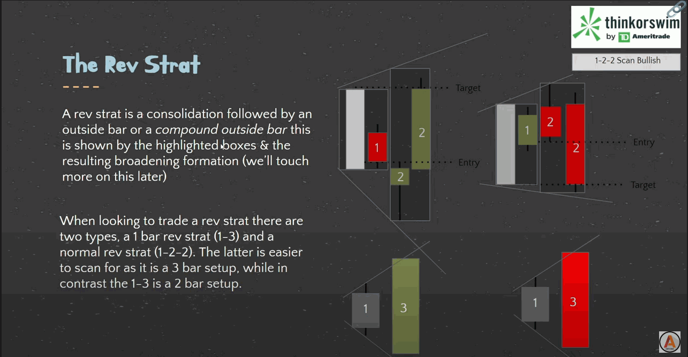
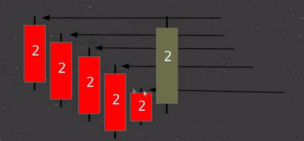
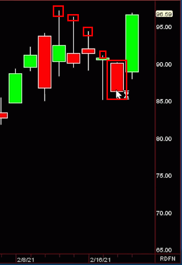

# The Strat

The Strat teaches us *What do we know to be true?*

So what do We know to be true? There are 3 universal scenarios and 4 types of reversals and the time frame continuity principal.

"Price Action is not governed by physics, not mathematics, its an aggregate of aggression of the buying and selling participants which we can identify though timeframe continuity combined with actionable signals as defined by the 3 universal scenarios because its impossible for price not to trade within one of these three scenarios." By Rob Black

## The Scenarios

Here’s what we know, from one bar to the next, there are only three possible outcomes or scenarios.

!!! tip
    **If you are using Trading View you can use [Strat Assistant](https://www.tradingview.com/script/PWJRC2Nt-Strat-Assistant/)**

### Scenario 1

In the first scenario the second bar is too weak to make a new high and too strong
To make a new low. This is called an inside bar and by definition is consolidating.  The most important thing to remember is to not trade anything forming on an inside bar. Wait until something breaks either on the upside or downside before taking it.

### Scenario 2

The second scenario is where the second bar takes out one side of the previous range.  This by definition can be considered directional trending as a break has discernably occurred in one direction.

### Scenario 3

The third scenario is where the second bar takes out both sides of the previous range. Thus reversing
it’s attempt to trend as you can’t have a scenario 3 without going scenario 2 first. This is
known as an outside bar.

## Confirm

* Are all participation groups confirming each other?  Are they going in the same direction?

## Change

* Are the participation groups changing the continuity of the other groups?

## Control

* Determination of control though confirming conflicting or changing continuity levels
* We always need to stablish which participation groups are in control, and for how long
* Monthly = Institutional Group
* Daily = Who is control today
* 60 = Who is in control right now

## Uncoupling

Is the first time during any month where the opening prices of the 4 major time frame occur at different times.

* On any Monday, the Daily and Weekly opening prices are the same.
* During the first hour on Tuesday, the opening prices of the 60 group and Daily group are the same
* The earliest an uncoupling can occur is the second hour of trading on Tuesday
* THIS MEANS that we gain more quantitative evidence in which to gauge the probability of our trades based on the separation of the participation groups
* If the last day of the month is between Friday and Sunday, uncoupling doesn't occur until the second hour of trading on the FOLLOWING Tuesday.
* If the month ends any other day, the uncoupling occurs the second hour of the following day

## Time Frame Continuity

* Participants that are represented by the various time frames
* Day Trading, Swing Trading, Scalping, Long Term Investing
* Can separate them by price and time (Universal Truths: High, Low, Open, Close)
* We need time to pass in order to identify the groups.  We prefer four separate openings
* Any time the Monthly, Weekly, Daily and Hourly are all red, the algos are hitting the bids
* Any time the Monthly, Weekly, Daily and Hourly are all green, the algos are hitting the ask

When mastering time frame continuity keep in mind control, confirm, conflict, and change. Remember that the 60 is always in control because it tells you what’s happening in that moment. Reversals become important when you run into conflict. Identifying reversals such as 2-1-2 on the downside that forms a shooter can turn the rest of your time frames red, if it continues.

## The Flip
* Every new hour
* Rob recommends we aggregate at the bottom of the hour
* Opening starts at the bottom as does Euro market closes and several other
* important liquidity events (oil, natural gas, numbers)

* The 60 min group is very important as it will determine who is in control
* When the 60 and the daily are confirming they override the weekly and the monthly for control
* The Flip (bottom of the hour) will continue to confirm the daily for control or give control back to the 60, weekly and monthly if they are in agreement

## RevStrat

Don't be confused by the name.   A RevStrat is not just a reversal.  A RevStrat is a consolidation followed by an outside bar or a *compound outside bar* this is shown by the highlighted boxes & the resulting broadening formation.

When looking to trade a RevStrat there are two types, 1 bar RevStrat (1-3) and a normal rev strat (1-2-2).  The latter is easier to scan for as it is a 3 bar setup, while in contrast the 1-3 is a 2 bar setup.

## Reversals

Reversals can come in the form of Actionable Signals along with some key candlestick patterns.  When looking at actionable signals there are hammers, shooters, and reversals to take into consideration.

We always want to be entering on reversals and adding on continuation patterns.  The main things we look at are the 2-2 Rev Strat, 2-1-2 Rev Strat, or the failed 2 goes 3.

* **Hammers** are important because they indicate when to take immediate entry. When a candle breaks through the hammer candle you know that a reversal is present and there is a good potential to entry

* **Shooters** These signals occur when the seller starts taking profits, creating the shooter. The shooter is live on the next bar, and that’s when you hit it. It’s important to remember that the shooter doesn’t indicate to get out right away, you have to look at the next bar to determine what to do.

Refer to the [Patterns](patterns.md) section to see examples of **Hammers** and **Shooters**.

!!! important
    It is very important that we are always forward thinking and understanding "what if" scenarios which could change the continuity on the higher timeframes and change the entire course of trading.

## Broadening Formation

* A broadening formation is exactly what it sounds like; something that broadens
* When trading we use broadening formations to gauge magnitude (Where price is going) because they have to occur in order for price to trade up and down
* As shown previously a "3" candle is by definition a broadening formation because it has made a higher high and a lower low in comparison to the previous candle; also known as broadening the range
* Boradening formations give us magnitude though the use of compound outside bars
* Compound outside bars are 2 or more bars that create a **3** when they are compounded together
* Every (x)-2-2 reversal uses a compound outside bar as it's target
* All a broadening formation is telling us is there is a higher high and and a lower low
* When drawing a broadenting formation you draw them front to back (right to left) in order to get all all of the data possible, ideally it should be a SLIGHT lower low and SLIGHT higher high

## Sara Strat Sniper 50 Percent Rule

The 50% is for potential outside bars only.

1. Live Candle Must take out 1 side of previous closed candle
2. Live Candle must retrace 50% or more of previous closed candle
3. Target is the other side of previous closed candle

## Robism

### Simultaneous Break

* When Rob says **Inside 60s the flavor** that means we have a high concentration of Inside 60s that all start to break in the same direction which is called a simultaneous break.
* This can occur on any timeframe and not just the 60
* Very powerful if this occurs on the Monthly on the SPY and all the market sectors and broader averages
* When this occurs it typically means there is a lot of Institutional Buying or Selling happening
* If there are a lot of failed 2s or 3s on daily or weekly then we have a bias and we are looking for another simultaneous break and it means they are not just buying something, there buying or selling everything.

### Pivot Machine Gun (PMG)

A pivot is where people likely have their stops.

When looking at a pivot machine gun you'll notice there is 5 pivots to the upside that haven't been hit, this means over the past 5 days (if looking at a daily chart) anyone short had no reason to exit their position so we know they are STILL short

Once we've identified this we then know to buy the first reversal INTO these pivots.  When that occurs you are stopping people out while also having the daily participants bit up the price.

When this occurs you have people getting stopped out (bidding the price up & removing liquidity) as well as buyers becoming aggressive which creates a large & quick move into the pivots.  This is a great example of why we look to trade though previous range, going into All Time Highs or All Time Lows means you don't stop anyone out and have exhaustion risk.   This doesn't mean we don't take stocks that are strongly going into All Time Highs it just means we would prefer to take stocks that are not.

### Use To Be Somebody

* When Rob says **Use to be Somebody** it means that we are having a reversal back though previous range that use to be something **higher**.
* And the reason we do, when the buyers are aggressive  on full timeframe continuity to the upside and coming back through previous range, anyone who is short will be short against known pivots which produces the pivot machine gun.
* Sometimes **Use to be Somebody**'s can be very powerful and will make a lot of money

### Enforce

* When a monthly candle is 2-2 Reversal you don't have to take it right away.
* The 2-2 Reversal is enforced all Month so any time you have additional signals to the downside we are going to be looking for that.
* Look for reversals on any lower timeframe (Weekly, Daily, 60s, 30s and 15s) into full timeframe continuity to get in

### Exhaustion Risk

* Exhaustion risk can occur when going though a broadening formation
* The reason we call it exhaustion is because anybody short doesn't have any more pivots to be short against (hence exhaustion) and buyers have to step up
* This can lead to a fade near exhaustion risk
* Usually happens in new highs or new lows

### Motherbar Issues

* Once you have an inside bar, the bar previous to it is called a motherbar
* Sometimes its hard to get out of the motherbar and it ends up as a chopshop

### Triangle They Out

* Triangle They Out, they always do
* A Triangle They Out is really nothing more then corrective activity (aka a pull back)
* If you don't get stopped out then typically this is where you can add to your winning position
* Don't want to take the countertrend trade because you are fighting time frame continuity

### Kicking Pattern

* 2-2 RevStrat where the first 2 is about 80% of the candle is Long or Short

## Winning and Loosing Trades

### Losing trades look like...

1. Chopped up trading a scenario 1.
2. Scenario 2 going against you
3. Scenario 3 going against you
4. Time frame Continuity going against you

### Winning Trades look like....

1. Scenario 2 in your favor
2. Scenario 3 in your favor
3. Time frame continuity in your favor

