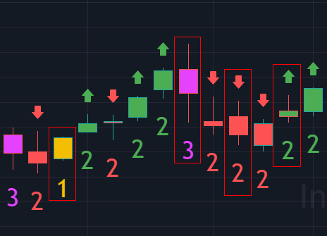

# The Strat

The Strat teaches us *What do we know to be true?*

## Key References

* [What Do We Know to be True About Price Action?](https://www.newtraderu.com/2019/02/13/what-do-we-know-to-be-true-about-price-action/)

* [How to Trade The Strat with Small Accounts with Jermaine The Strat Soldier](https://pro.benzinga.com/blog/how-to-trade-the-strat-with-small-accounts-with-jermaine-the-strat-soldier)

* [The Strat - Rob Smoths In The Black](https://www.youtube.com/user/smithsintheblack)

* [Learn this Profitable Strategy With No Indicators #TheStrat](https://www.youtube.com/watch?v=505mcZfeOYQ)

[Algorithmic Price Action Trading Strategies](https://www.newtraderu.com/2020/07/04/algorithmic-price-action-trading-strategies)

## Winning and Loosing Trades

### Losing trades look like...

1. Chopped up trading a scenario 1.
2. Scenario 2 going against you
3. Scenario 3 going against you
4. Time frame Continuity going against you

### Winning Trades look like....

1. Scenario 2 in your favor
2. Scenario 3 in your favor
3. TIme frame continuity in your favor

## The Scenarios

Here’s what we know, from one bar to the next, there are only three possible outcomes or scenarios.

### Scenario 1

In the first scenario the second bar is too weak to make a new high and too strong
To make a new low. This is called an inside bar and by definition is consolidating.  The most important thing to remember is to not trade anything forming on an inside bar. Wait until something breaks either on the upside or downside before taking it.

### Scenario 2

The second scenario is where the second bar takes out one side of the previous range.  This by definition can be considered directional trending as a break has discernably occurred in one direction.

### Scenario 3

The third scenario is where the second bar takes out both sides of the previous range. Thus reversing
it’s attempt to trend as you can’t have a scenario 3 without going scenario 2 first. This is
known as an outside bar.

### Other Terminology

The Motherbar - The bar prior to the inside is typically referred to as a "mother bar".

## Time Frame Continuity

* Particppants that are represented by the various time frames
* Day Trading, Swing Trading, Scalping, Long Term Inveting
* Can separate them by price and time (Universal Truths: High, Low, Open, Close)
* We need time to pass in order to identify the groups.  We prefer four separate openings
* Any time the Monthly, Weekly, Daily and Hourly are all red, the algos are hitting the bids
* Any time the Monthly, Weekly, Daily and Hourly are all green, the algos are hitting the ask

When mastering time frame continuity keep in mind control, confirm, conflict, and change. Remember that the 60 is always in control because it tells you what’s happening in that moment. Reversals become important when you run into conflict. Identifying reversals such as 2-1-2 on the downside that forms a shooter can turn the rest of your time frames red, if it continues.

### The Flip
* Every new hour
* Rob recommends we aggregate at the bottom of the hour
* Opening starts at the bottom as does Euro market closes and several other
* important liquidity events (oil, natural gas, numbers)

* The 60 min group is very important as it will determine who is in controle
* When the 60 and the daily are confirming they override the weekly and the monthly for controle
* The Flip (bottom of the hour) will continue to confirm the daily for control or give control back to the 60 weekly and monthly if they are in agreement

### Tips for Weekly Scenrios

### Tips for Monthly Scenarios

### TTO "Triangle They Out" a Rob-ism
"Triangle They Out" often followed by Git!!!

*Sara's Interpretation*
"Triangle, tight stop guys just got shaken out".  Now is the time to look to get in.

Why I don't use the term TTO & prefer to use these vernacular's instead.
1 - top or bottom of tri - good time to start looking for a reversal
1. corrective activity - don't want to take the countertrend trade because you are fighting time frame continuity

NOTE: When playing the monthly or higher timeframes you don't always want to take the first entry.

Also when in taking Monthly or Weekly plays time frame continuity is all green then don't short, look at it and treat the 2D  on the lower timeframes as corrective activities or a pull back.

## Reversals

Reversals can come in the form of Actionable Signals along with some key candlestick patterns.  When looking at actionable signals there are hammers, shooters, and reversals to take into consideration.

* **Hammers** are important because they indicate when to take immediate entry. When a candle breaks through the hammer candle you know that a reversal is present and there is a good potential to entry

* **Shooters** These signals occur when the seller starts taking profits, creating the shooter. The shooter is live on the next bar, and that’s when you hit it. It’s important to remember that the shooter doesn’t indicate to get out right away, you have to look at the next bar to determine what to do.

Refer to the [Patterns](patterns.md) section to see examples of **Hammers** and **Shooters**.

Live! #SSS 50PercentRule EXPLAINED on the Monthly

1) Live Candle Must take out 1 side of previous closed candle
2) Live Candle must retrace 50% of previous closed candle
3) Target is the other side of previous closed candle
