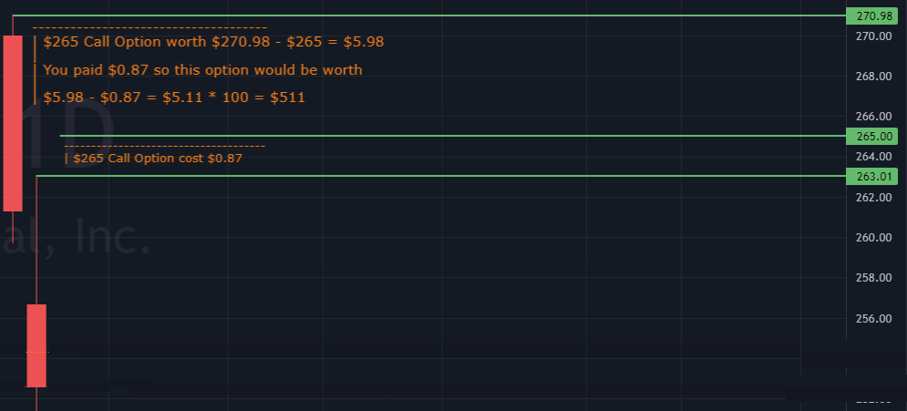

# Options

* An options contract is an agreement between two parties to facilitate a potential transaction involving an asset at a preset price and date.
* For stock options, a single contract covers 100 shares of the underlying stock.

## Benzinga Options Trading School Classes

1. [Introduction to Options](https://www.benzinga.com/school/past/661992315)
2. [Introduction to Options Q/A](https://www.benzinga.com/school/past/664349075)

3. [Understanding Options Greeks](https://www.benzinga.com/school/past/661993304)
4. [Q&A Session - Understanding Option Greeks](https://www.benzinga.com/school/past/662328063)

5. [Option Volatility](https://www.benzinga.com/school/past/661993896)
6. [Q&A Session - Option Volatility](https://www.benzinga.com/school/past/662328566)

7. [Single-Leg Option Strategies](https://www.benzinga.com/school/past/661994470)

Inspiration of this came from AlexOptions youtube video:
[OPTIONS TRADING | The easiest way to trade & choose options contracts](https://www.youtube.com/watch?v=XWwIvYvySOA)

## Call Option
Gives you the rigth to buy 100 shares for a premium.

If you buy a $10 call for $2.00 then you break even is your (strike price + premium) which is $12.

If this call expired today at $12 you would break even and the intrinsic value of the call contract would be worth $2.00.

## Put Option
Gives you the right to sell 100 shares for for a premium.

If you buy a $10 put for $2.00 then you break even is your (strike price - premium) which is $8.

## Call Scenario

When picking an option is critcal to find a strike price which gives the Intrinsic Value (Target - Strike Price) greater then your break even price which is the amount of Money you spent on the premium to buy the option in the first place.

As Alex Says *Its going to be easier to buy a cheap option and have that cheap option become expnsive then buy an expeisive option and have that expensive option beceome even more expensive.*

In the Example below this is a good option since the option price is cheap [$0.87] and the overal gains from a successful trade (hitting your target) would result in $511.  So an $87 dollar investment returned $511 return which is a 587% return.

