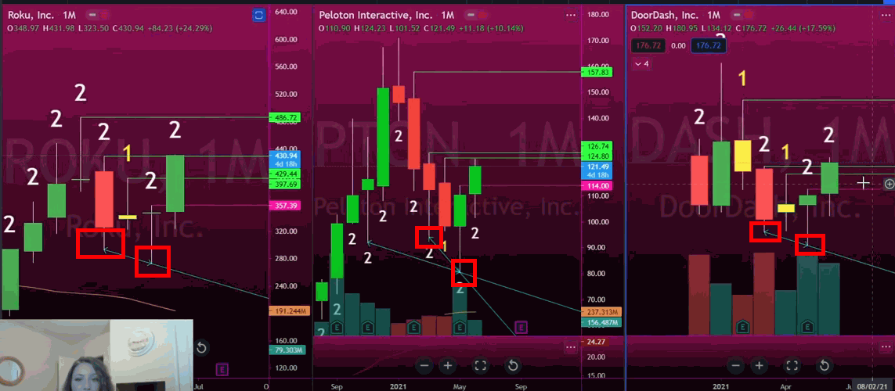

# The Strat Swing Trading Tips

Tips for Swing Trading The Strat

## Tips for Swing Trading

* Always wait for corrective activity to happen as we don't want to get TTO (Triangled Them Out)

* You want to put your stop under the corrective activity.

* You don't need to be the first person in.  Wait for a TTO on the daily timefame

* Every reversal back into full time frame continuity you can enter on or add to your position on.

